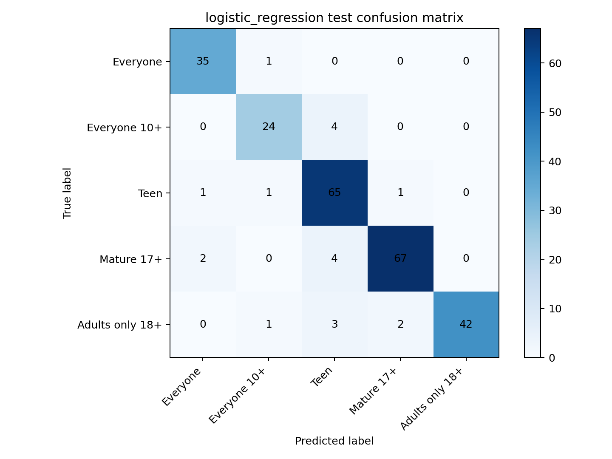
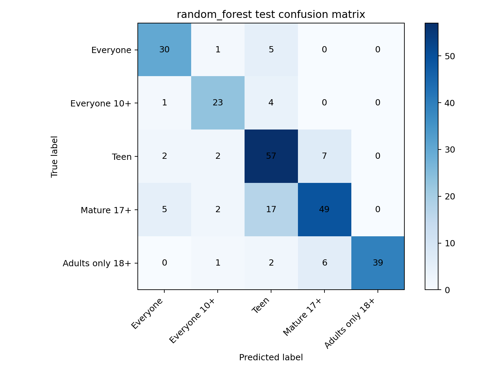

# Google Play 年龄分级问卷的黑盒逆向建模 —— 实验报告

## 一、实验概述

Google Play 要求开发者在后台填写一份内容分级问卷，系统据此自动判定应用的年龄分级
（ESRB / 北美地区）。但 Google 从未公开问卷答案到最终分级的映射规则，开发者只能看到
填写后的结果，无法预知每个问题的答案会如何影响分级。

本实验将 Google Play 年龄分级问卷视为一个**黑盒系统**，通过自动化采集 1,265 组
"问卷答案 → 分级结果"配对数据，使用机器学习逆向建模这个映射关系，并分析哪些
问卷问题真正驱动了分级决策。

**预测目标**：`rating__north_america`（北美 ESRB 分级），5 个类别：

| ID | 类别 | 含义 |
|:--:|------|------|
| 0 | Everyone | 全年龄 |
| 1 | Everyone 10+ | 10 岁以上 |
| 2 | Teen | 青少年 |
| 3 | Mature 17+ | 17 岁以上 |
| 4 | Adults only 18+ | 仅限成人 |

---

## 二、数据收集策略与数据集

### 2.1 问卷结构

Google Play 的 IARC 内容分级问卷是一个**树状分支结构**：

- 首先选择应用类别（"All Other App Types" / "Game" / "Social or Communication"）
- 不同类别激活不同的问题分支——某些敏感问题（如赌博、药物）只在特定类别中出现
- 问题之间存在依赖关系：父问题的答案决定子问题是否激活
- 问题类型包括 radio（单选）和 checkbox（多选）
- 未被激活的问题标记为 `__INACTIVE__`

### 2.2 采样策略

由于人工穷举所有答案组合不可行（组合空间巨大），本实验采用**基于树结构的 DFS 系统性采样**：

1. **Baseline 样本**：对每个分支选择一条默认路径，覆盖所有问题
2. **单因素变体**：在 baseline 基础上，每次只改变一个问题的答案，观察分级变化
3. **成对组合**：对同一分支内的敏感问题两两组合，探测交互效应

这种策略确保覆盖不同问卷分支和不同内容风险类型，同时避免大量无信息量的重复样本。

### 2.3 自动化收集

通过 Chrome CDP（Chrome DevTools Protocol）编写脚本，自动在 Google Play Developer Console 中：
1. 登录开发者账号
2. 导航到内容分级问卷页面
3. 按预设的答案组合填写问卷
4. 提交并记录返回的年龄分级结果
5. 重置问卷，进行下一轮

采集过程中记录每次提交的完整问卷答案和分级结果。原始采集事件共 2,035 次，
其中 770 次因页面状态、导航问题等原因失败，成功采集 1,265 条有效记录。

### 2.4 数据集概况

**数据清洗**（Task 3）后：

| 指标 | 数值 |
|------|:----:|
| 原始样本 | 1,265 |
| 通过验证 | 1,265（100%） |
| 排除样本 | 0（Task 3 阶段无额外排除） |
| 上游排除 | 43（30 类别异常 + 13 分级冲突，记录在 excluded_samples.csv） |
| 训练集 | 1,012 |
| 测试集 | 253 |

**按应用类别分布**：

| 类别 | 总数 | 训练 | 测试 |
|------|:---:|:---:|:---:|
| All Other App Types | 616 | 492 | 124 |
| Game | 633 | 507 | 126 |
| Social or Communication | 16 | 13 | 3 |

> ⚠️ Social or Communication 类别样本极少（16 条），对其的结论需保持谨慎。

**按年龄分级分布**：

| 分级 | 总数 | 训练 | 测试 | 类别权重 |
|------|:---:|:---:|:---:|:------:|
| Adults only 18+ | 241 | 193 | 48 | 1.045 |
| Everyone | 182 | 146 | 36 | 1.385 |
| Everyone 10+ | 138 | 110 | 28 | 1.841 |
| Mature 17+ | 365 | 292 | 73 | 0.695 |
| Teen | 339 | 271 | 68 | 0.747 |

数据按 `category + rating__north_america` 分层划分，测试比例 20%，种子固定为 `osn-lab2-task3-v1` 以保证可复现。

---

## 三、特征工程

### 3.1 编码方案

原始数据包含 164 个问卷答案字段和 10 个地区分级字段。特征工程（Task 4）的处理如下：

- **排除列**：`sample_id`、`split`、所有 `rating__*` 列（仅保留 `rating__north_america` 作为标签）
- **Radio 问题**（133 列）：one-hot 编码，每个可选值产生一个 0/1 特征
- **Checkbox 问题**（32 列）：multi-hot 编码，按 ` || ` 分割后每个选项产生一个 0/1 特征
- **`category` 字段**：one-hot 编码
- **结构性缺失值**：`__INACTIVE__`、`__NOT_APPLICABLE__`、`__NONE__` 保留为显式特征

| 指标 | 数值 |
|------|:----:|
| 原始特征列 | 165 |
| 编码后特征列 | **758** |
| 训练集 | 810 |
| 验证集 | 202 |
| 测试集 | 253（与 Task 3 测试集一致） |

验证集从训练集按 `category + rating` 分层划分（20%，种子 `osn-lab2-task4-v1`）。

### 3.2 为什么保留结构性缺失值

传统的缺失值处理（均值填充、众数填充）假设数据是随机缺失的。但在树状问卷中，
"问题未被激活" (`__INACTIVE__`) 本身就是一种有意义的信号——它意味着该样本的
应用类别不触发该问题分支。后续 SHAP 分析证实了这一点：`__INACTIVE__` 多次出现在
Top-15 重要特征中。

### 3.3 数据局限性

- Social or Communication 类别仅 16 条样本，对该类别的模型表现需保守解读
- 验证集/测试集中可能出现训练集未见过的新答案值，记录在 `unseen_values.json` 中，编码器对其忽略处理

---

## 四、模型训练与超参数优化

### 4.1 模型选择

按照实验要求至少测试 3 种模型，本实验共训练了 **4 种不同类型的模型**：

| 模型 | 类型 | 原理 |
|------|------|------|
| Logistic Regression | 线性模型 | L1 正则化 + saga 求解器，自动特征选择 |
| Random Forest | 集成树模型 | 500 棵决策树 bagging |
| LightGBM | 梯度提升树 | 基于直方图的 boosting |
| XGBoost | 梯度提升树 | 基于直方图的 boosting |

所有模型均使用 `class_weight='balanced'` 处理类别不均衡。

### 4.2 超参数优化

**Logistic Regression 和 Random Forest** 通过网格搜索进行系统化调优：

**逻辑回归搜索空间**（53 种组合）：

| 参数 | 搜索范围 |
|------|---------|
| penalty / l1_ratio | L1 (l1_ratio=1.0), L2, ElasticNet (l1_ratio ∈ [0.1, 0.9]) |
| C | 0.01, 0.05, 0.1, 0.5, 1.0, 2.0, 5.0, 10.0 |
| tol | 1e-4, 1e-3 |

**逻辑回归最优参数**：

| 参数 | 最优值 | 含义 |
|------|--------|------|
| l1_ratio | 1.0 | L1 正则化（稀疏解） |
| C | 10.0 | 弱正则化，允许更大特征权重 |
| tol | 1e-4 | 严格收敛容差 |
| solver | saga | 支持 L1 + 稀疏数据 |
| max_iter | 5000 | 充足迭代次数 |

**随机森林搜索空间**（162 种组合）：

| 参数 | 搜索范围 |
|------|---------|
| n_estimators | 300, 500, 800 |
| max_depth | 10, 20, None |
| min_samples_leaf | 1, 2, 4 |
| max_features | 0.2, 0.3, sqrt |
| min_samples_split | 2, 5 |

**随机森林最优参数**：

| 参数 | 最优值 | 含义 |
|------|--------|------|
| n_estimators | 500 | 500 棵树 |
| max_depth | None | 不限深度 |
| min_samples_leaf | 1 | 叶节点最少 1 样本 |
| max_features | 0.3 | 每棵树采样 30% 特征 |
| min_samples_split | 2 | 2 样本即可分裂 |

**LightGBM 和 XGBoost** 使用固定参数配合 early stopping（patience=30），未进行网格搜索。

### 4.3 调优效果（以随机森林为例）

| 指标 | 默认参数 (test) | 调优后 (test) | 提升 |
|------|:---:|:---:|:---:|
| Accuracy | 0.617 | **0.783** | +26.9% |
| Macro F1 | 0.624 | **0.797** | +27.7% |

默认参数 `max_features='sqrt'` 在 758 维上仅采样 √758≈27 个特征，
改为 `max_features=0.3`（228 个特征）显著提升了树的判别能力。

---

## 五、模型性能对比

### 5.1 综合排名

| 排名 | 模型 | Test Accuracy | Test Macro F1 | Test Macro AUC |
|:----:|------|:------------:|:------------:|:-------------:|
| 🥇 | **Logistic Regression (L1)** | **0.921** | **0.918** | **0.977** |
| 🥈 | XGBoost | 0.850 | 0.850 | 0.964 |
| 🥉 | Random Forest | 0.783 | 0.797 | 0.945 |
| 4 | LightGBM | 0.629 | 0.630 | 0.903 |

### 5.2 最佳模型各类别性能（Logistic Regression, Test Set）

| 类别 | Precision | Recall | F1 | Support |
|------|:---------:|:------:|:---:|:-------:|
| Everyone | 0.921 | 0.972 | **0.946** | 36 |
| Everyone 10+ | 0.889 | 0.857 | **0.873** | 28 |
| Teen | 0.855 | 0.956 | **0.903** | 68 |
| Mature 17+ | 0.957 | 0.918 | **0.937** | 73 |
| Adults only 18+ | 1.000 | 0.875 | **0.933** | 48 |

"Everyone 10+" 的 F1（0.873）相对较低——该类别样本最少（28 个）且处于中间地带，
与 Everyone 和 Teen 的边界较为模糊。

### 5.3 验证集与测试集表现

| 模型 | Val Acc | Val F1 | Test Acc | Test F1 | 泛化差距 |
|------|:------:|:------:|:--------:|:-------:|:------:|
| Logistic Regression | 0.936 | 0.928 | 0.921 | 0.918 | 1.1% |
| Random Forest | 0.812 | 0.811 | 0.783 | 0.797 | 1.7% |

泛化差距小（< 2%），模型未见明显过拟合。

---

## 六、结果分析

### 6.1 逻辑回归为什么赢了

**L1 正则化的逻辑回归以 0.918 Macro F1 显著胜出**，领先第二名的 XGBoost 约 7 个百分点。

根因：问卷答案经 one-hot 编码后形成**高维稀疏特征空间**（758 维，绝大多数维度为 0）。
L1 正则化自动做特征选择——将 80.6% 的特征权重压缩为 0，仅保留约 736 个非零权重
（分布在 5 个类别间）。这种稀疏解天然适配高维稀疏数据，而树模型需要大量轴对齐分裂
才能逼近一个线性决策面，效率低且在小样本下容易过拟合。

**L1 稀疏度统计**：

| 指标 | 数值 |
|------|:---:|
| 总权重数 | 3,790（5 类 × 758 特征） |
| 非零权重 | 736（19.4%） |
| 被压缩为 0 | 3,054（80.6%） |

各类别保留的非零特征数：

| 类别 | 非零特征数 |
|------|:---------:|
| Everyone | ~147 |
| Everyone 10+ | ~147 |
| Teen | ~147 |
| Mature 17+ | ~147 |
| Adults only 18+ | ~147 |

各类别之间仅有少量特征重叠——大多数特征只对某一个类别有区分力。

### 6.2 影响分级的核心信号

通过 SHAP 分析（XGBoost）和 L1 系数分析（Logistic Regression），锁定了
Google Play 判定年龄分级的关键问卷问题：

| 排名 | 影响因素 | 来源 |
|:----:|---------|------|
| 1 | 血/暴力程度 (`what_is_the_level_of_blood_and_or_gore`) | SHAP Top-1 |
| 2 | 生殖器/性内容出现频率 (`how_frequently_does_the_genitalia_appear`) | SHAP Top-2 |
| 3 | 色情/挑逗性场景（inactive 分支标记） | SHAP Top-3 |
| 4 | 非法/娱乐性药物引用 | SHAP Top-4 |
| 5 | 药物相关的推断/暗示 | SHAP Top-5 |

### 6.3 结构性缺失值携带信息

`__INACTIVE__`（问题不在激活分支）多次出现在 Top-15 重要特征中。
Google 问卷的树形分支结构**隐式编码了内容风险评估的决策树逻辑**——
某些敏感问题被问到本身就是高风险信号，而未被问到同样暗示了低风险。

> 结论：对分支结构的问卷数据，**保留缺失 sentinel 比统计插补更有利于建模**。

### 6.4 问卷高度冗余

按 L1 系数绝对值排序，逐步增加特征数量训练逻辑回归：

| 特征数 | Test Accuracy | 占全量性能 |
|:------:|:------------:|:------:|
| 10 | 0.435 | 47% |
| 50 | 0.625 | 68% |
| 200 | **0.933** | **101%** |
| 758（全量） | 0.921 | 100% |

**仅用 200 个特征（26%）就能达到全量 758 特征的性能**，甚至略超——
说明剩余 558 个特征几乎不提供额外区分力。Google Play 问卷存在大量可删减的问题。

### 6.5 分级边界存在天然灰色地带

使用逻辑回归预测概率进行分析。Top-1 和 Top-2 概率差距（Margin Gap）反映模型的确定性。
最不确定的样本集中在 **"Teen ↔ Mature 17+"** 边界：

| 样本 | 第一预测 | P1 | 第二预测 | P2 | Gap |
|:----:|---------|:---:|---------|:---:|:--:|
| #126 | Mature 17+ | 0.364 | Everyone | 0.363 | 0.001 |
| #239 | Mature 17+ | 0.443 | Teen | 0.442 | 0.001 |
| #228 | Teen | 0.404 | Adults only 18+ | 0.395 | 0.009 |

这不是模型的缺陷——它恰恰反映了 ESRB 分级标准的内在模糊性。
"Teen" 和 "Mature 17+" 之间的界限，即使人工分级委员会也经常出现争议。

各类别平均置信度：Everyone（最高）> Adults only 18+ > Mature 17+ > Teen > Everyone 10+（最低），
两端类别比中间类别更易判定。

---

## 七、实验中遇到的问题及解决方法

### 7.1 数据收集阶段

| 问题 | 影响 | 解决方法 |
|------|------|---------|
| 问卷保存后页面状态不稳定 | 50 次"未解析到分级"错误 | 不固定等待时间，改为循环检测保存完成状态，自动重试 |
| 恢复/导航逻辑异常 | 14 次导航失败 | 增加页面状态断言，失败时重置到已知状态 |
| 超时/模态弹窗遮挡 | 8 次超时 | 增加弹窗检测和自动关闭逻辑 |
| 成对组合中父问题依赖未满足 | 2 次子问题不可见 | 修复成对组合生成器，合并后验证父依赖 |
| 赌博相关 cash-reward 分支路由错误 | 少数样本分支错误 | 通过正确的 checkbox 子节点路由 |

### 7.2 模型训练阶段

| 问题 | 影响 | 解决方法 |
|------|------|---------|
| LightGBM 严重欠拟合（F1=0.63） | 性能远低于预期 | 分析确认是模型与高维稀疏数据不匹配，非代码错误 |
| 随机森林默认参数性能差（F1=0.62） | 比 LR 低 25 个百分点 | 网格搜索发现 `max_features=0.3` 是关键调整 |
| sklearn 版本升级导致 `penalty` 参数被弃用 | 警告信息 | 改用新版 API（`l1_ratio=1.0` 替代 `penalty='l1'`） |
| Social or Communication 仅 16 条样本 | 该类别的模型评估不可靠 | 不对此类别做单独结论，仅报告整体指标 |

### 7.3 工程问题

| 问题 | 影响 | 解决方法 |
|------|------|---------|
| Windows Git CRLF 转换 | 可能导致 Task 3 哈希校验失败 | 建议添加 `.gitattributes` 锁定数据文件换行符 |
| matplotlib 字体缓存散落用户目录 | 污染用户环境 | 设置 `MPLCONFIGDIR` 到项目 `.matplotlib/` 目录 |

---

## 八、关键图表

### 8.1 模型性能对比



*图 1：逻辑回归在测试集上的混淆矩阵（Test Accuracy = 0.921）*



*图 2：随机森林在测试集上的混淆矩阵（Test Accuracy = 0.783）*

### 8.2 更多分析图表

以下分析图表在 [analysis.ipynb](task5_2_logistic_regression&random_forest/analysis.ipynb) 中交互式生成：

- 模型性能对比柱状图（val/test side-by-side）
- L1 系数分布直方图 & 各类别非零特征数
- 每类 Top-10 关键特征词（可读文本）
- 随机森林 MDI 特征重要性 Top-20
- 置信度分布直方图 & 各类别平均置信度
- 灰色地带样本特征拉扯分析
- 特征冗余度曲线（特征数 vs 准确率）

---

## 九、核心代码

### 9.1 最终训练脚本

```python
# train_models.py 的核心模型定义（最优参数已硬编码）
from sklearn.linear_model import LogisticRegression
from sklearn.ensemble import RandomForestClassifier

models = {
    "logistic_regression": LogisticRegression(
        C=10.0, l1_ratio=1.0, tol=1e-4,
        solver="saga", max_iter=5000,
        class_weight=class_weight_by_id, random_state=42,
    ),
    "random_forest": RandomForestClassifier(
        n_estimators=500, max_depth=None, min_samples_leaf=1,
        max_features=0.3, min_samples_split=2,
        class_weight=class_weight_by_id, random_state=42, n_jobs=-1,
    ),
}
```

完整脚本：[train_models.py](task5_2_logistic_regression&random_forest/train_models.py)

### 9.2 数据分析 Notebook

深度分析（L1 稀疏解、特征重要性、灰色地带、冗余度）：
[analysis.ipynb](task5_2_logistic_regression&random_forest/analysis.ipynb)

### 9.3 复现命令

```bash
# 数据清洗
python task3_data_cleaning/scripts/clean_data.py

# 特征工程
python task4_feature_engineering/scripts/build_features.py

# 最终模型训练（最优参数已硬编码，直接运行）
python task5_2_logistic_regression&random_forest/train_models.py
```

---

## 十、总结

### 主要发现

1. **L1 正则化逻辑回归是最优模型**——Test Accuracy 0.921，Macro F1 0.918，显著优于树模型。
   高维稀疏特征天然适合线性分类器。

2. **Google Play 的年龄分级主要由血/暴力、性内容、药物引用三类问题驱动**。
   SHAP 和 L1 系数分析一致指向相同的关键特征。

3. **问卷高度冗余**——仅需 200/758 个特征即可达到全量性能，Google 可以大幅简化问卷。

4. **分级边界存在内在模糊性**——"Teen vs Mature 17+" 是最典型的灰色地带，
   模型的不确定性反映了标准本身的模糊性，而非模型缺陷。

5. **结构性缺失值不应被填充**——`__INACTIVE__` 等 sentinel 携带显著的预测信息。

### 项目交付物

| 交付物 | 位置 |
|--------|------|
| 自动化数据收集脚本 | `task3_data_cleaning/scripts/` |
| ≥1000 条有效样本数据集 | `task3_data_cleaning/output/` |
| 特征工程代码 | `task4_feature_engineering/scripts/` |
| 4 种模型训练与性能对比 | `analysis_report.md`（本文档） |
| 关键结果图表 | `task5_2_*/output/` + `analysis.ipynb` |
| 完整实验报告 | `analysis_report.md`（本文档） |

---
